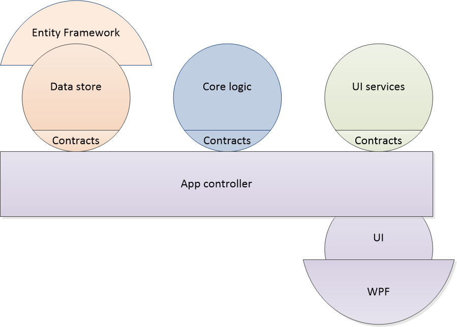
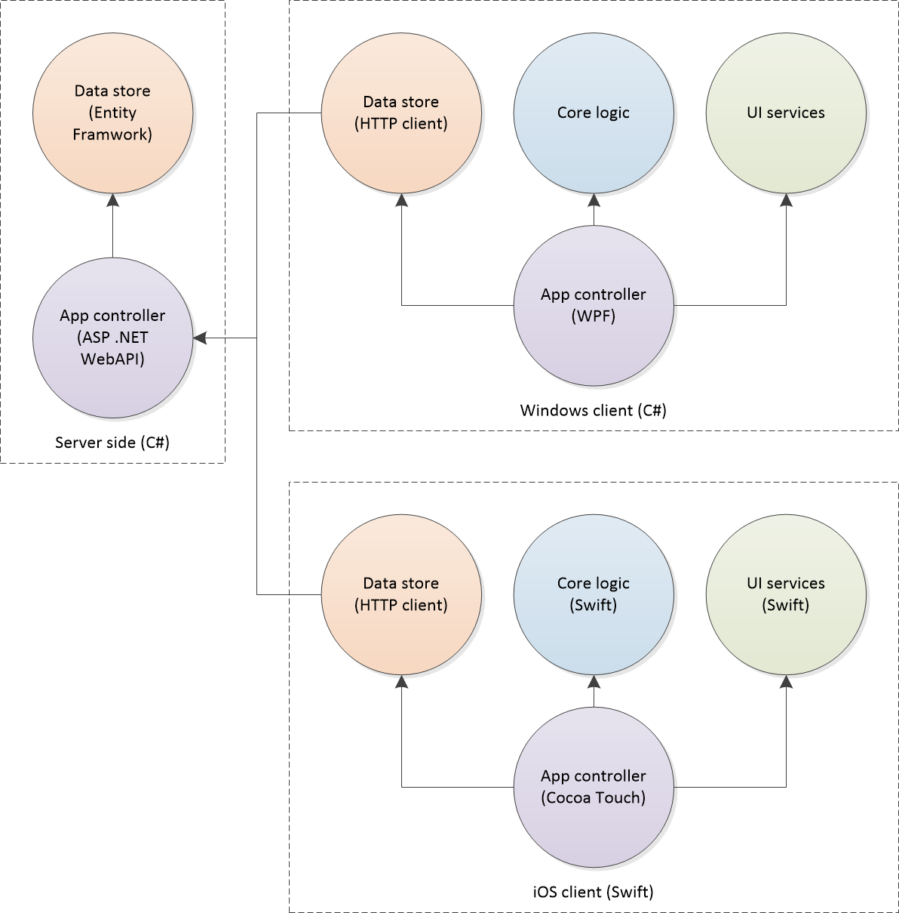

# Onion architecture sample

## Onion architecture
[Onion architecture](http://adrianbontea.com/2014/03/10/cone-architecture/) is all about starting with the core of a system and adding layers on top of it.

Moreover, I'd say that we can have multiple onions in a system, each with its own responsibilities. For example, core logic can be separated from user interface logic, and neither should be dependent of each other (except that some data they share - passed using different DTOs, though - at runtime).

Of course, in this case you will also need to have a controller layer on top of the onions, to bootstrap the application. On the other hand, the infrastructural-dependent implementations for the marginal onions (like the data store and the user interface) can be again separated from their interfaces, and only the app controller will depend on them.

Furthermore, if we have different target platforms to support, we can share the same concepts (logic and data models) in the core onion copies that we'll create for the app controllers defined for different technologies. And for each onion, actually only the contracts are static: the implementations can be different, for example if during maintainance we will need to swift from Entity Framework and SQL Server database as data storage, for example, to using plain XML files it will not be a pain to do it. Or, another example, if we decide to move storage to the client side, it will be very simple to just switch to not using a REST API but a local storage folder instead.

## Sample problem
We have to develop a software system composed of:
 - Core logic that performs a set of operations on input data, returning output data;
 - Data store that persists:
   - data that can be used as input for the core logic (read/write)
   - results obtained from the logic mapped to the input data they were computed (read only);
 - User interface that allows the end user to:
   - view and manage input data (add, update, remove items) and view past output data in the store;
   - select input data, run core logic operations on selected items, see the results (using colors based on unit price ranges) and optionally save output items to the store.

### Operations
As an example, the logical operation can be aggregating an order by selecting product instances to purchase, grouping them as product quantities and computing total prices.
Stored input data is represented by a list of products, each defined by a unique ID, a name, and a unit price.
Output data is represented by the submitted orders, supplemented by date of creating the order, and of an address to deliver them to.
Finally, the user interface allows the en user to:
 - view and manage products and view previously submitted orders;
 - select products, add them to a cart one by one, aggregating an order, enter a delivery address, and submit (save) it.

### Constraints
We would like to develop apps for multiple platforms, e.g. Windows to run on PCs, and iOS to run on iPhones and iPads (later, also Android to run on other mobile phones or tablets, and JavaScript to make it available on all Web browsers.)
The user interface and experience should be similar, although minor differences are accepted as target platforms may have different development guidelines.

However, the database should be common (same data should be visible from apps running on different machines and platforms), and therefore it should be stored on a central server (e.g. Windows Server or in the cloud), being accessible from the apps through the network (e.g. REST API).

The logic operations should use the client side processors (not hosted server side to ensure increased app performance and avoid server or cloud costs). Of course, for the same input the operations should return same output, regardless of the target platform running the code.

To avoid inherent issues of cross-platform development tools and frameworks (like Xamarin, Cordova and/or Bridge.net) we'll do the work using multi-platform development (separate projects for client platforms, and for the server side). Note also that user and app authentication and authorization are out of the scope of this phase of the project (they will be handled in the future).

## Solution
With onion architecture orientation, we should start with the core logic, and focus on details (data store and user interface) later. Finally, we'll bootstrap everything into an app using a controller to hook them up and make them work together.

However, without thinking about the target platforms and technologies we can use, we can also consider these are three core onions and an app controller to implement: the logic, the data store, and the user interface services.

As we target multiple platforms but we don't want to think about them yet, we can define the core logic, data store interface (to be later implemented differently on server and on client sides), user interfaces services, and the app controller in pure pseudo code and with agnostic data modeling.

Alternatively, we can start with one platform (one programming language and some infrastructure, preferably common between server and a client type) and then continue with the rest. This saves us some time as we can skip pseudo-code and UML diagramming, but it's safe only if we know the technologies very well to represent our documentation when we'll go on other platforms.

### Implementation
The associated solution includes implementation stubs for the C# and WPF parts of the software system.
